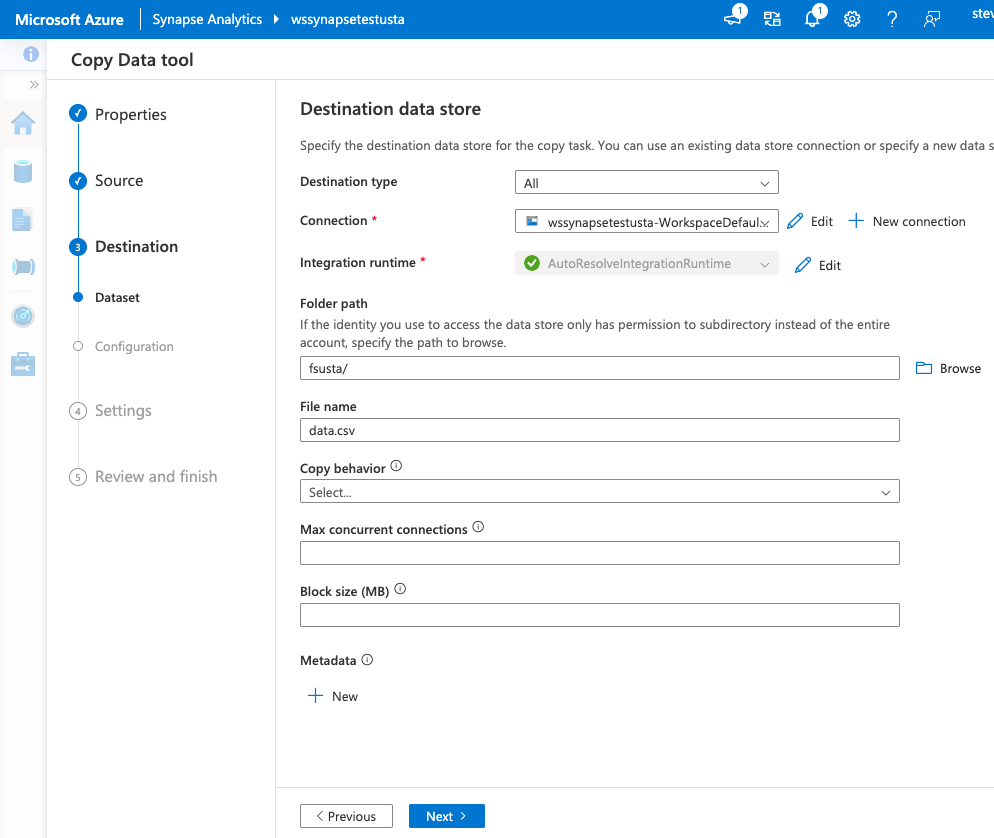
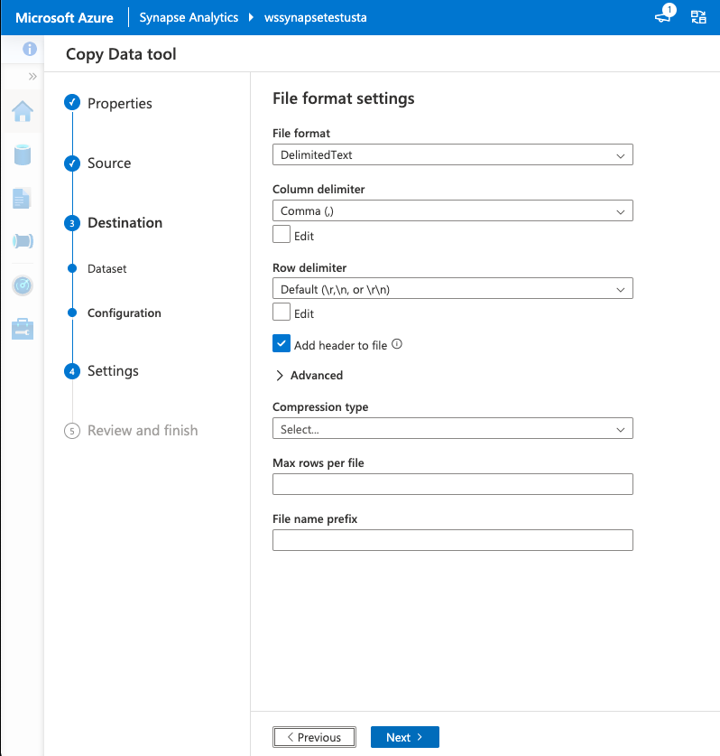

# Batch Analytics

## Batch Analytics with Data Lake Analytics Service

Process big data jobs in seconds with Azure Data Lake Analytics. There is no infrastructure to worry about because there are no servers, virtual machines, or clusters to wait for, manage, or tune. Instantly scale the processing power, measured in Azure Data Lake Analytics Units (AU), from one to thousands for each job. You only pay for the processing that you use per job.

U-SQL is a simple, expressive, and extensible language that allows you to write code once and have it automatically parallelized for the scale you need. Process petabytes of data for diverse workload categories such as querying, ETL, analytics, machine learning, machine translation, image processing, and sentiment analysis by leveraging existing libraries written in .NET languages, R, or Python.

In this lab Learn how to 

* use Data Lake Analytics to run big data analysis jobs that scale to massive data sets
* how to create and manage batch, real-time, and interactive analytics jobs, and 
* how to query using the U-SQL language

## Create Azure Data Lake Analytics Service

Create Data Lakae Analytics service to mine data stored in Data Lake Store.

Click on **Create a resource**

Click on **Data + Analytics**

Click on **Data Lake Analytics**

Pick the Data Lake Store where device telemetry data is being stored from Stream Analytics job

Use existing resource group and click on Create button

## Create Job

Click on Sample scripts 

